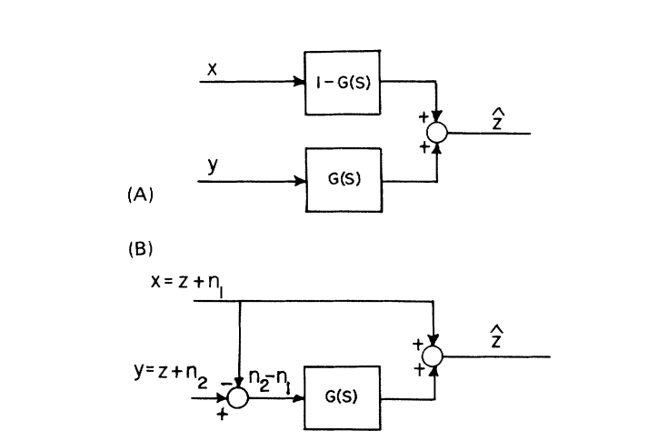
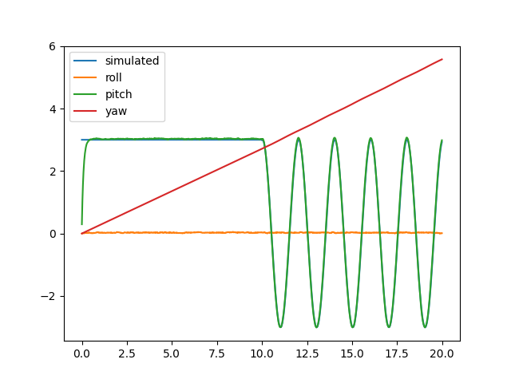

### Complementary filter

Complementary filter fuses data from IMU (Intertial Measurement Units) sensors such as accelerometer, magnetometer, gyroscope and pedometer. Configuration of sensors that are in use during the position estimation process may vary depending on the quality of signal from sensors. For instance, it is common to work with accelerometer and gyroscope, rejecting other sensors if signal from corresponding sensors is noisy.

The example directory contains code that simulates IMU measuremetns of pendulum and estimates pendulum orientation with the complementary filter. It is possible to plot the result of orientation estimation with python script located at helpers directory.

### What is a complementary filter

The basic complementary filter is shown in a picture below.



Where z is an input signal, x and y are noisy measurements of this signal. $\hat{z}$ is an estimation of the output signal produced buy the filter. Assume that
the noise in y is mostly high frequency, and the noise in x is mostly low frequency. Then G(s) can be made a low-pass filter to filter out the high-frequency noise in y. If G(s) is low-pass, [1 - G(s)] is the complement, i.e., a high-pass filter which filters out the low-frequency noise in x. The complementary filter can be reconfigured as in figure B. In this case the input to G(s) is

$$y - x = n_2 - n_1,$$
 
 so that the filter G(s) just operates on the noise or error in the measurements x and y. In the case of noise less or error-free measurements

$$\hat{z} = z[1 - G(s)] + zG(s) = z,$$


i.e., the signal is estimated perfectly.

Gyroscope obtains the angular position of the object by integrating the angular velocity over time. Gyroscope is a very precise sensor and not susceptible to external forces. But because of integration, the measurement tends to drift, not returning to zero when the system goes back to its original position. Accelerometer is a sensor which takes into consideration every small forse therefore it can be easily disturbed. That is why the accelerometer data is reliable only on a long term. The advantage of accelerometer is that it does not drift. A magnetometer is a device that measures magnetic field or magnetic dipole moment.

In case if the measurements from different sources give precise information in different frequency regions, it is convenient to use a weighted sum of measurements from these sources.

[//]: # "angle = alpha * (angle + gyrData * dt) + beta * accData + gamma * magnData)"

$$\phi = \alpha * (\phi + gyrData * dt) + \beta * accData + \gamma * magnData$$

where alpha, beta, gamma are constant weights of different measurement sources.

### Low and high pass filters

Low-pass filter is a filter that passes signals with a frequency lower than a selected cutoff frequency.
Transfer function of low-pass filter

[//]: # "https://en.wikipedia.org/wiki/Low-pass_filter"

$$H(s) = \frac{\omega_0}{s + \omega_0}$$

where $\omega_0$ is a cutoff frequency of a filter

Low-pass filter is the complement of a high-pass filter. High-pass filter is a filter that passes signals with a frequency higher than a certain cutoff frequency.
Transffer function of high-pass filter

$$H(s) = \frac{s}{s + \omega_0}$$

Consider a first-order integrator

$$\dot{x} = u$$

with the folowing measurement characteristics

$$y_x = L(s)x + \mu_x,\hspace{5mm} y_u = u + \mu_u + b(t)$$

Measurements $y_x$ and $y_u$ can be fused into an estimate $x_{est}$ of a state $x$ via the filter

$$x_{est} = F_1(s)y_x + F_2(s)\frac{y_u}{s}$$

A filter is called a complementary filter if 

$$F_1(s) + F_2(s) = 1$$

### Comparison with Kalman filter

Complementary filter outperforms Kalman filter significantly by using less computational and processing power and providing more accuracy. The Complementary filter can be applied by having only vector and quaternion mathematical operators. On other hand, the traditional Kalman filter needs an enormous number of matrix operations, including multiplications and taking inverses of these matrices, which, besides the complexity, also results in high computational and processing costs.

### Calculations

Acceleration is stored in quaternion form. The weight part of it is a numeric value of the acceleration, the vector part -- vector components.

The goal of developing an estimator is to provide a smooth estimate $\hat{R(t)} \in SO(3)$ of a state R(t) that is evolving due
to some external input based on a set of measurements.

Frame of reference allows to determine the error. It can be calculated as follows

$$\dot{\hat{R}} = R^* \cdot R$$

$$err = acc \times \dot{\hat{R}}$$

The direct complementary filter dynamics are specified by

$$\dot{\hat{R}} = (R\Omega \cdot R\omega)\times \hat{R}$$

The $R^*$ operation is an inverse operation on $SO(3)$

The kinematics can be written directly in terms of the quaternion representation of $SO(3)$ by

$$\dot{q} = q \times p(\Omega)$$

Quaternion is multiplied by the pure rotation quaternion $p(\Omega)$, where real part is equal to zero.
In the source code provided `updateQuaternion(mQ, rotation)` function which does the same calculations.

The gyroscope data is integrated every timestep with the current angle value:

```cpp
    omega = gyro * dt + mIntegralError * dt;
```

### Components

The following constant coefficients are the weights applied to accelerometer, gyroscope and magnetometer components.

```cpp
double     mKaccelerometer;
double     mKmagnetometer;
double     mKintegralGain;
```

### Build

To build the project for running tests make sure that `BUILD_TESTS` option is turned on.

```sh
cd /standalone_algorithms/complementary_filter
cmake -Bbuild -H.
cmake --build build
```

Run tests:

```sh
./build/test-filter
```

### Results of orientation


