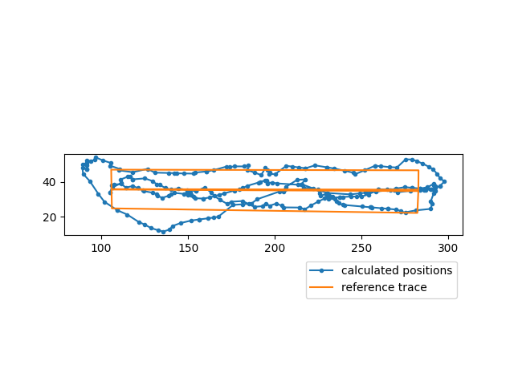

### Position Estimation

Using RSSI data from transmitters it is possible to estimate the position of moving object. Estimation is being held according to the distance between the source of signals and the destination.

### Measurement Preprocessor

The information about transmitters is stored in `/logs/transmitters.txt` file in a format `tid, coordinates, type`

```
(38945,2275,F7826DA6-4FA2-4E98-8024-BC5B71E0893E) 238.52 21.3 BEACON
```

Measurements are stored in `/logs/measurements.log` in the folowing format `timestamp, tid, rssi, type`

```
1541003875242 (56813,7748,F7826DA6-4FA2-4E98-8024-BC5B71E0893E) -82 BEACON
```

All the measurements are divided into packets. Preprocessor checks if measurements in the packet are valid:

- if the signal type is supported
- if rssi is in cutoff borders

After that the last measurements are added into measurements buffer. The size of measuremets package is kept limited.

### Position Smoothing

[//]: # "https://en.wikipedia.org/wiki/Alpha_beta_filter"

Postprocessing of the position is made by position smoother algorithm that is called alpha-beta filter.

In this very low order approximation position $x$ is obtained as the time integral of velocity $v.$ Assuming that velocity remains approximately constant over the small time interval $\Delta T$ between measurements, the position state is projected forward to predict its value at the next sampling time using equation

$$\hat{x_k} = \hat{x_{k-1}} + \Delta T\hat{v_{k-1}}$$

$$\hat{v_k} \leftarrow \hat{v_{k-1}}$$

Residual between output measurement and prediction

$$\hat{r_k} \leftarrow x_k - \hat{x_k}$$

$\alpha$ and $\beta$ coefficients are chosen to correct the position estimation

$$\hat{x_k} \leftarrow \hat{x_k} + \alpha\hat{r_k}$$

$$\hat{v_k} \leftarrow \hat{v_k} + \frac{\beta}{\Delta T}\hat{r_k}$$

An extra $\Delta T$ factor conventionally serves to normalize magnitudes of the multipliers.

For convergence and stability, the values of the alpha and beta multipliers should be positive and small:

$$0 < \alpha < 1$$
$$0 < \beta \leq 2$$
$$4 - 2\alpha - \beta > 0$$

Initial characteristics of the smoothing are set to zero, coefficient $\alpha$ is determined by the smoothing coefficient.

### Model of signal transferring

Distance between the source of signal and destination can be converted to signal strength

$$P(d) = A - B\log{d^{2}}$$
$$B\log{d^2} = A-P(d)$$
$$\log{d^2} = \frac{A - P(d)}{B}$$
$$d^2 = exp\left ( \frac{A - P(d)}{B} \right )$$
$$d = \sqrt{exp\left ( \frac{A - P(d)}{B} \right )}$$

### Results of Position Estimation

Calculated position with precision is written into `output.log` in the folowing format `timestamp, coordinates, precision`

```
1541003922247 172.704 27.2699 1.55804
```

### Build

```sh
cd /standalone_algorithms/position_estimation
cmake -Bbuild -H.
cmake --build build
```

Run examples:

```sh
./build/position-estimation
```

### Results of position estimation

