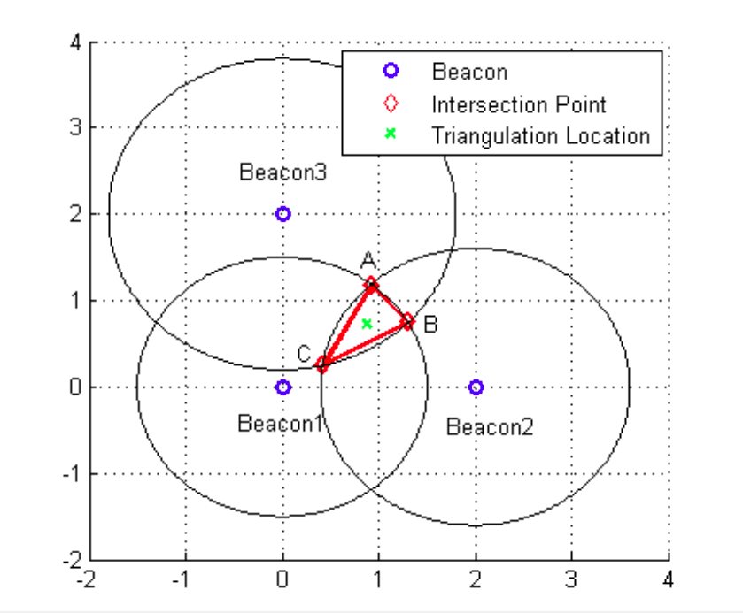

### Trilateration

This is a method of determining coordinates of a device using measurements of pseudo distances to all visible beacons or signal transmitters. For navigation purposes you may also operate with RSSI readings. We use this algorithm for indoor navigation along with the distance/RSSI measurements from Bluetooth LE 4.0 Beacons.

Algorithm with all required functions and data structures is presented as class in trilateration.h, beacon.h files.

Example of the algorithm usage and filling of data structures you can find in a unit test for this source code in the test_trilateration.cpp file.

### Algorithm

Most indoor positioning are implemented based on Received Signal Strength Index (RSSI). Mobile device receives signal from beacon with known location. The distance between mobile device and beacon is calculated using RSSI of received signal.

The algorithm consists of several phases:

1. Preprocessing
2. Trilateration
3. Triangulation
4. Least squares estimation

Preprocessing includes deleting duplicated measurements and filtering unknowing beacons.

### Triangulation

Triangulation is the process of determining the location of a point by forming triangles to the point from known points. Once mobile device knows distance from three known beacon, triangulation is performed to determine its coordinates. In the figure below there are three circles, centered at each beacon with radius equals to the distance between each beacon and mobile device. The triangulation location is the centroid of the triangle ABC, which consists of cords of the intersection part of three circles.



However if we get all distances between the mobile and reference nodes, they are not likely intersecting into one point. Therefore we need some algorithms to calculate the estimated location of the mobile.

### Least Squares Estimation

LSE is widely used in the distance based positioning systems. Equation on the mobile location can be set as

$$Y = AX$$

where Y is a known n-dimensional vector, A is NxM matrix. If N>M, the number of equation is greater than the
number of unknown numbers, we can obtain the optimal X using LSE. The idea of LSE is to make the least value of sum
of square of error

$$f(x) = (AX - Y)^2 = (AX - Y)^{T}(AX - Y)$$

We get the minimum of the above function, if $A^{T}A$ is nonsingular

$$X = (A^{T}A)^{-1}A^{T}Y$$

### Trilateration Algorithm

Trilateration is the geometrical problem of determining an unknown position on a plane based on the distance to other two known vertices of a triangle (the length of two sides).
Positioning by ranging is the determination of an object’s position by measuring the range to a number of objects at known locations. It is also known as lateration with trilateration denoting ranging using three signals and
multilateration ranging using more than three signals.

### Build

```sh
cd /standalone_algorithms/trilateration
cmake -Bbuild -H.
cmake --build build
```

Run tests:

```sh
./build/test
```